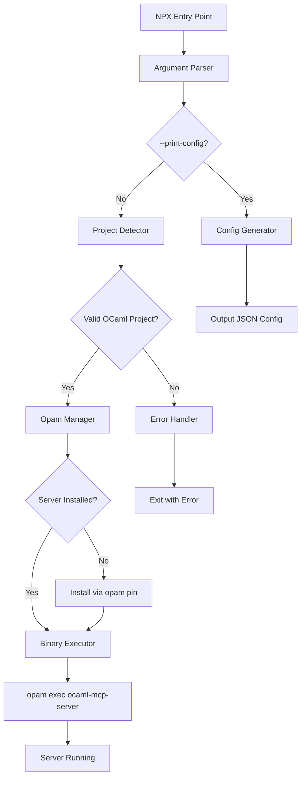

# Design Document

## Overview

The OCaml MCP NPX Wrapper is a lightweight Node.js package that acts as a bridge between the NPM ecosystem and the OCaml development environment. It provides zero-configuration installation and execution of ocaml-mcp-server through the familiar `npx` command interface. The wrapper automatically detects OCaml projects, manages opam-based installation, and delegates execution to the actual server binary while maintaining full compatibility with the Model Context Protocol.

## Steering Document Alignment

### Technical Standards (tech.md)
This design follows the documented technical patterns:
- **NPX Distribution Strategy**: Leverages NPM's ubiquity while using opam for OCaml integration
- **Silent Auto-Installation**: Implements zero-friction setup following NPX conventions
- **Process Delegation**: Maintains single source of truth by delegating to actual binary
- **Minimal Dependencies**: Uses only Node.js built-in modules, no external runtime dependencies
- **Error-First Patterns**: Implements Result-style error handling throughout

### Project Structure (structure.md)
The implementation follows project organization conventions:
- Located in `npx-wrapper/` directory within the repository
- Uses `kebab-case.js` naming for Node.js modules
- Organized with single-responsibility modules
- Test files co-located with source using `*.test.js` pattern
- Clear separation between wrapper logic and OCaml server

## Code Reuse Analysis

### Existing Components to Leverage
- **ocaml-mcp-server binary**: The actual MCP server implementation - wrapper delegates all server functionality
- **Opam ecosystem**: Leverage opam's dependency resolution and installation capabilities
- **Node.js built-ins**: Use child_process, fs, path modules for all system interactions
- **NPM distribution**: Use NPM registry for package distribution and versioning

### Integration Points
- **Opam switch**: Integrates with current opam switch for installation
- **OCaml project structure**: Detects standard OCaml project markers (dune-project, *.opam)
- **MCP protocol**: Passes through all MCP communication unchanged
- **Process environment**: Preserves all environment variables for server execution

## Architecture

The wrapper follows a modular, pipeline architecture where each component has a single responsibility and clear interfaces. The architecture prioritizes fail-fast error handling and minimal overhead.

### Modular Design Principles
- **Single File Responsibility**: Each module handles one specific domain (argument parsing, project detection, etc.)
- **Component Isolation**: Modules are independently testable with mocked dependencies
- **Service Layer Separation**: Clear separation between I/O operations and business logic
- **Utility Modularity**: Shared utilities extracted into focused helper modules



## Components and Interfaces

### Component 1: Argument Parser (`lib/argument-parser.js`)
- **Purpose:** Extract wrapper-specific arguments and prepare server arguments
- **Interfaces:** 
  ```javascript
  parseArgs(args: string[]): { 
    repoUrl: string | null, 
    printConfig: boolean,
    serverArgs: string[] 
  }
  ```
- **Dependencies:** None (pure function)
- **Reuses:** Node.js argument parsing patterns

### Component 2: Project Detector (`lib/project-detector.js`)
- **Purpose:** Validate OCaml project context and prerequisites
- **Interfaces:**
  ```javascript
  detectProject(cwd: string): Promise<{
    success: boolean,
    projectRoot: string | null,
    error: string | null
  }>
  validateEnvironment(): Promise<{
    success: boolean,
    opamAvailable: boolean,
    error: string | null
  }>
  ```
- **Dependencies:** fs.promises for file system access
- **Reuses:** Standard OCaml project detection patterns

### Component 3: Opam Manager (`lib/opam-manager.js`)
- **Purpose:** Check installation status and manage opam pinning
- **Interfaces:**
  ```javascript
  isServerInstalled(): Promise<boolean>
  installServer(repoUrl: string): Promise<{
    success: boolean,
    error: string | null
  }>
  ```
- **Dependencies:** child_process for opam command execution
- **Reuses:** Opam CLI interface patterns

### Component 4: Binary Executor (`lib/binary-executor.js`)
- **Purpose:** Execute ocaml-mcp-server with proper environment and argument forwarding
- **Interfaces:**
  ```javascript
  executeServer(args: string[]): void // Never returns, delegates process
  ```
- **Dependencies:** child_process.spawn for process delegation
- **Reuses:** Standard process delegation patterns

### Component 5: Config Generator (`lib/config-generator.js`)
- **Purpose:** Generate MCP client configuration JSON
- **Interfaces:**
  ```javascript
  generateConfig(options: { repoUrl?: string }): string
  ```
- **Dependencies:** None (pure function)
- **Reuses:** MCP configuration format

### Component 6: Error Handler (`lib/error-handler.js`)
- **Purpose:** Provide consistent, actionable error messages
- **Interfaces:**
  ```javascript
  handleError(error: { 
    type: string, 
    message: string, 
    details?: any 
  }): void
  ```
- **Dependencies:** None (console output only)
- **Reuses:** Error categorization patterns

### Main Entry Point (`bin/ocaml-mcp-server.js`)
- **Purpose:** Orchestrate component execution flow
- **Dependencies:** All components above
- **Flow Control:** Implements main execution pipeline

## Data Models

### ParsedArguments
```javascript
{
  repoUrl: string | null,        // Custom repository URL if provided
  printConfig: boolean,          // Generate config instead of executing
  serverArgs: string[]           // Arguments to forward to server
}
```

### ProjectContext
```javascript
{
  success: boolean,              // Whether valid project detected
  projectRoot: string | null,    // Root directory of OCaml project
  hasOpam: boolean,             // Whether opam is available
  error: string | null          // Error message if detection failed
}
```

### InstallationResult
```javascript
{
  success: boolean,              // Whether installation succeeded
  installedPath: string | null,  // Path to installed binary
  error: string | null,         // Error message if installation failed
  stderr: string | null         // Raw stderr output for debugging
}
```

### MCPConfig
```javascript
{
  mcpServers: {
    "ocaml-dev": {
      command: "npx",
      args: [
        "@ocaml-mcp/server",
        "--root", "${workspaceFolder}"
      ]
    }
  }
}
```

## Error Handling

### Error Scenarios

1. **Not in OCaml Project**
   - **Handling:** Exit with clear message about required project context
   - **User Impact:** Error message with instructions to navigate to OCaml project

2. **Opam Not Installed**
   - **Handling:** Provide platform-specific installation instructions
   - **User Impact:** Actionable error with links to opam installation guide

3. **Installation Failure**
   - **Handling:** Display opam error output and suggest manual installation
   - **User Impact:** Full error details with fallback installation commands

4. **Network Issues**
   - **Handling:** Distinguish between network timeouts and repository errors
   - **User Impact:** Clear indication of network problem vs. repository issue

5. **Server Execution Failure**
   - **Handling:** Pass through server errors unchanged
   - **User Impact:** Original server error messages preserved

6. **Invalid Repository URL**
   - **Handling:** Validate URL format before attempting installation
   - **User Impact:** Clear message about URL format requirements

## Testing Strategy

### Unit Testing
- **Approach:** Test each component in isolation with mocked dependencies
- **Key Components to Test:**
  - Argument parser with various input combinations
  - Project detector with different directory structures
  - Opam manager with mocked command execution
  - Config generator output validation
  - Error handler message formatting
- **Coverage Target:** 90% line coverage minimum

### Integration Testing
- **Approach:** Test component interactions with real file system and processes
- **Key Flows to Test:**
  - Fresh installation workflow
  - Subsequent execution with cached installation
  - Custom repository installation
  - Error propagation through component chain
  - Signal handling and cleanup
- **Test Environment:** Temporary directories with mock OCaml projects

### End-to-End Testing
- **Approach:** Test complete user workflows in real OCaml projects
- **User Scenarios to Test:**
  - First-time user installing and running server
  - Developer using custom repository
  - Configuration generation for Claude Desktop
  - Error recovery from various failure states
  - Cross-platform compatibility (macOS, Linux, WSL)
- **Validation:** Verify MCP server actually responds correctly

## Performance Considerations

### Startup Optimization
- **Installation Check Caching:** Cache installation status for current session
- **Lazy Loading:** Only load modules when needed in execution path
- **Process Spawning:** Use spawn instead of exec for better performance
- **Argument Parsing:** Optimize for common case (no special arguments)

### Memory Management
- **Stream Processing:** Don't buffer subprocess output unnecessarily
- **Module Loading:** Minimize require() calls in hot path
- **Cleanup:** Ensure all resources released on exit

### Installation Performance
- **Silent Mode:** No output unless errors occur (reduces I/O overhead)
- **Parallel Operations:** Where possible, run checks concurrently
- **Network Timeouts:** Reasonable timeouts for repository access

## Security Considerations

### Input Validation
- **Repository URLs:** Validate against URL format, prevent command injection
- **Arguments:** Sanitize all arguments passed to shell commands
- **File Paths:** Validate paths stay within project boundaries

### Process Security
- **Minimal Privileges:** Never request elevated permissions
- **Environment Isolation:** Don't modify global environment variables
- **Secure Defaults:** Default to official repository only

### Error Information
- **Full Debugging Support:** Display complete error information including paths and commands (appropriate for a development tool)
- **Debug Mode:** Support verbose output for troubleshooting installation issues
- **Stack Traces:** Include full stack traces when errors occur for easier debugging

## Implementation Dependencies

### Runtime Dependencies (Production)
- **None:** Only Node.js built-in modules used

### Development Dependencies
```json
{
  "devDependencies": {
    "jest": "^29.0.0",          // Testing framework
    "mock-fs": "^5.0.0",         // File system mocking
    "eslint": "^8.0.0",          // Code quality
    "prettier": "^3.0.0"         // Code formatting
  }
}
```

### Node.js Version Requirements
- **Minimum:** 14.0.0 (for fs.promises and modern JavaScript features)
- **Recommended:** 18.0.0+ (current LTS)
- **Features Used:** async/await, optional chaining, nullish coalescing

## Future Extensibility

### Planned Extensions
- **Generic Opam Package Wrapper:** Generalize the wrapper to work with any opam package, making it a universal NPX bridge for the OCaml ecosystem
- **Update Detection:** Check for newer versions of installed packages
- **Multiple Switches:** Support for selecting specific opam switches
- **Workspace Support:** Handle multiple OCaml projects in workspace
- **Offline Mode:** Cache for offline development
- **Package Discovery:** List available opam packages that could be wrapped

### Extension Points
- **Custom Installers:** Plugin system for alternative installation methods
- **Configuration Providers:** Support for different MCP client configs
- **Platform Handlers:** Specialized handling for different operating systems
- **Logging Adapters:** Pluggable logging for different environments
- **Package Adapters:** Modular system to handle different opam package types and requirements