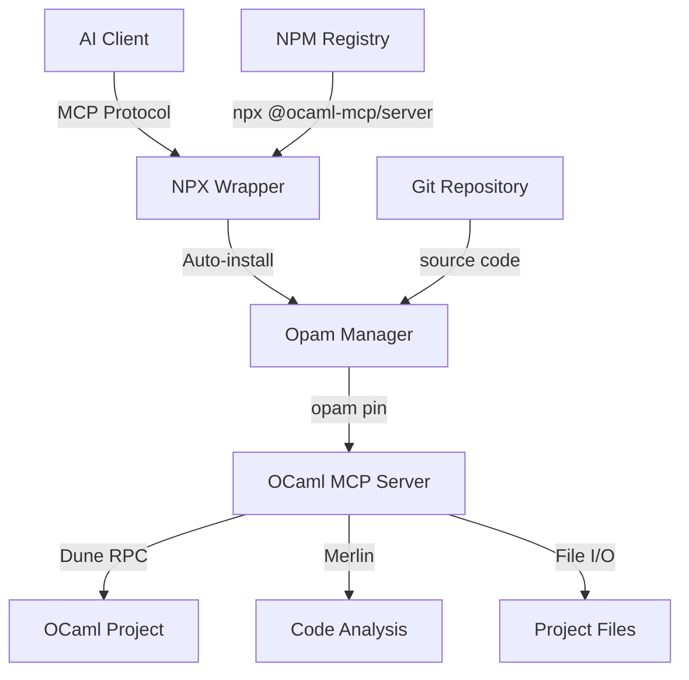

# Technical Steering

## Architecture Overview

### System Architecture


### Technology Stack Choices

#### Core Components
- **Distribution Layer**: NPM/NPX for cross-platform package management
- **Runtime Layer**: Node.js for wrapper script (universal availability)
- **Installation Layer**: Opam for OCaml ecosystem integration
- **Server Layer**: OCaml native binary (ocaml-mcp-server)
- **Protocol Layer**: MCP (Model Context Protocol) for AI communication

#### Technology Rationale
- **NPX**: Ubiquitous, zero-install, works across all platforms
- **Node.js**: Most accessible runtime for wrapper scripts
- **Opam**: Standard OCaml package manager, handles dependencies correctly
- **OCaml**: Native performance, strong typing, ecosystem integration
- **MCP**: Standardized AI-context protocol, future-proof

### Integration Patterns

#### Wrapper Architecture
- **Argument Parsing**: Extract wrapper-specific args (--repo) before forwarding
- **Environment Validation**: Check OCaml project context and prerequisites
- **Auto-Installation**: Silent opam pin with error handling
- **Process Delegation**: Forward to actual binary via opam exec
- **Error Propagation**: Preserve exit codes and error output

#### OCaml Server Integration
- **Dune RPC**: Real-time build status and diagnostics
- **Merlin**: Code analysis and type information
- **File System**: Direct project file access and modification
- **Process Management**: Execute OCaml tools (dune, ocaml) as needed

### Data Flow Design

#### Installation Flow
1. NPX downloads wrapper from NPM registry
2. Wrapper validates OCaml project environment
3. Wrapper checks for existing ocaml-mcp-server installation
4. If missing: opam pin from specified repository
5. Execute via opam exec with forwarded arguments

#### Runtime Flow
1. AI client connects via MCP protocol
2. NPX wrapper forwards to OCaml server
3. Server analyzes OCaml project structure
4. Server provides tools for build status, code analysis, file operations
5. Server returns structured responses via MCP

## Development Standards

### Coding Conventions

#### Node.js Wrapper Code
- **ES6+ Syntax**: Use modern JavaScript features
- **Async/Await**: Prefer async/await over callbacks or raw promises
- **Error-First**: Consistent error handling patterns
- **Pure Functions**: Minimize side effects, prefer functional style
- **Explicit Types**: Use JSDoc for type annotations

#### OCaml Server Code (Reference)
- **Functional Style**: Leverage OCaml's functional programming strengths
- **Type Safety**: Use OCaml's type system for correctness
- **Modular Design**: Clear module boundaries and interfaces
- **Error Handling**: Use Result types for error propagation

### Testing Requirements

#### Unit Testing
- **Coverage Target**: 90% code coverage minimum
- **Test Framework**: Jest for Node.js components
- **Mocking Strategy**: Mock external dependencies (opam, file system)
- **Test Organization**: Co-locate tests with source code

#### Integration Testing
- **Real Environment**: Test with actual OCaml projects
- **Process Testing**: Test opam command execution
- **Error Scenarios**: Test all failure modes
- **Platform Testing**: Test on multiple platforms

### Security Guidelines

#### Input Validation
- **Argument Sanitization**: Validate all user inputs
- **Path Validation**: Prevent directory traversal attacks
- **Command Injection**: Sanitize all shell commands
- **Repository URLs**: Validate git URLs before using

#### Process Security
- **Minimal Privileges**: Run with least necessary permissions
- **Sandboxing**: Isolate file system access to project directories
- **Network Security**: Only connect to trusted repositories
- **Error Information**: Don't leak sensitive paths in error messages

### Performance Standards

#### Startup Performance
- **Cold Start**: < 2 minutes for first-time installation
- **Warm Start**: < 1 second for subsequent runs
- **Memory Usage**: < 50MB for wrapper process
- **CPU Usage**: Minimal overhead during delegation

#### Runtime Performance
- **Response Time**: < 500ms for typical MCP operations
- **Throughput**: Handle multiple concurrent requests
- **Scalability**: Work with large OCaml projects (1000+ modules)
- **Resource Usage**: Efficient memory and CPU usage

## Technology Choices

### Programming Languages and Versions
- **Node.js**: >= 14.0.0 (LTS support, widespread availability)
- **ECMAScript**: ES2020+ features (async/await, optional chaining)
- **OCaml**: >= 4.14.0 (for server, handled by opam)
- **Shell**: POSIX-compatible for maximum portability

### Frameworks and Libraries

#### Required Dependencies (Minimal)
- **child_process**: Node.js built-in for process spawning
- **fs/promises**: Node.js built-in for async file operations  
- **path**: Node.js built-in for path manipulation
- **util**: Node.js built-in for utility functions

#### Development Dependencies
- **Jest**: Testing framework and assertion library
- **mock-fs**: File system mocking for tests
- **eslint**: Code quality and style consistency
- **prettier**: Code formatting

#### Dependency Philosophy
- **Minimize Runtime Deps**: Keep production dependencies to bare minimum
- **Leverage Node.js Built-ins**: Use standard library when possible
- **No Heavy Frameworks**: Avoid large dependencies like Express, etc.
- **Security First**: Only use well-maintained, trusted packages

### Development Tools
- **Version Control**: Git with conventional commit messages
- **Package Manager**: NPM (standard, reliable, universal)
- **CI/CD**: GitHub Actions for automated testing
- **Code Quality**: ESLint + Prettier for consistent style

### Deployment Infrastructure
- **NPM Registry**: Primary distribution mechanism
- **Semantic Versioning**: Follow semver for version management
- **Release Process**: Automated releases via GitHub Actions
- **Documentation**: Comprehensive README and API docs

## Patterns & Best Practices

### Recommended Code Patterns

#### Error Handling
```javascript
// Use Result-style error handling
async function executeCommand(command) {
  try {
    const result = await execAsync(command);
    return { success: true, data: result };
  } catch (error) {
    return { success: false, error: error.message };
  }
}
```

#### Argument Parsing
```javascript
// Extract wrapper args before forwarding
function parseArgs(args) {
  const repoIndex = args.indexOf('--repo');
  const repoUrl = repoIndex !== -1 ? args[repoIndex + 1] : DEFAULT_REPO;
  const forwardArgs = args.filter((arg, i) => 
    arg !== '--repo' && i !== repoIndex + 1
  );
  return { repoUrl, forwardArgs };
}
```

#### Process Delegation
```javascript
// Preserve exit codes and stdio
function delegateToServer(args) {
  const child = spawn('opam', ['exec', '--', 'ocaml-mcp-server', ...args], {
    stdio: 'inherit'
  });
  child.on('exit', (code) => process.exit(code));
}
```

### Logging and Monitoring
- **Structured Logging**: Use consistent log format
- **Log Levels**: Error, Warn, Info, Debug
- **No Verbose Output**: Silent by default, verbose on demand
- **Error Tracking**: Clear error messages with context

### Documentation Standards
- **README First**: Clear installation and usage instructions
- **API Documentation**: Document all public interfaces
- **Examples**: Provide working examples for common use cases
- **Troubleshooting**: Document common issues and solutions

## Architecture Decisions

### Key Technical Decisions

#### 1. NPX Distribution Strategy
**Decision**: Use NPX wrapper that auto-installs via opam
**Rationale**: Combines NPM's accessibility with opam's OCaml integration
**Trade-offs**: Slight complexity vs. much better UX

#### 2. Silent Auto-Installation
**Decision**: Install ocaml-mcp-server automatically without user confirmation
**Rationale**: Minimize friction, follow NPX conventions
**Trade-offs**: Less user control vs. better experience

#### 3. Repository Pinning
**Decision**: Use opam pin instead of published packages
**Rationale**: Get latest features, support development branches
**Trade-offs**: Less stability vs. more flexibility

#### 4. Process Delegation
**Decision**: Wrapper delegates to actual binary instead of reimplementation
**Rationale**: Maintain single source of truth, avoid duplication
**Trade-offs**: Slight overhead vs. maintainability

### Non-Decisions (Flexibility Points)
- **Testing Framework**: Could use other Node.js test runners
- **CI Platform**: Could use other CI systems besides GitHub Actions
- **Code Style**: Could adapt different style guides
- **Release Process**: Could use different release automation

## Future Architecture Considerations

### Scalability Plans
- **Caching**: Cache opam operations and build artifacts
- **Parallel Processing**: Handle multiple projects simultaneously
- **Resource Management**: Better memory and CPU optimization
- **Cloud Integration**: Support for remote development environments

### Technology Evolution
- **Protocol Upgrades**: Prepare for MCP protocol evolution
- **OCaml Ecosystem**: Adapt to new OCaml tooling and versions
- **Node.js Evolution**: Leverage new Node.js features as they stabilize
- **Platform Support**: Expand to additional platforms as needed

This technical steering provides the foundation for building robust, performant, and maintainable tooling that bridges the NPM and OCaml ecosystems effectively.